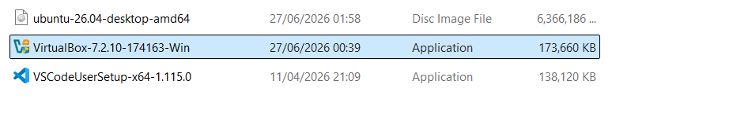
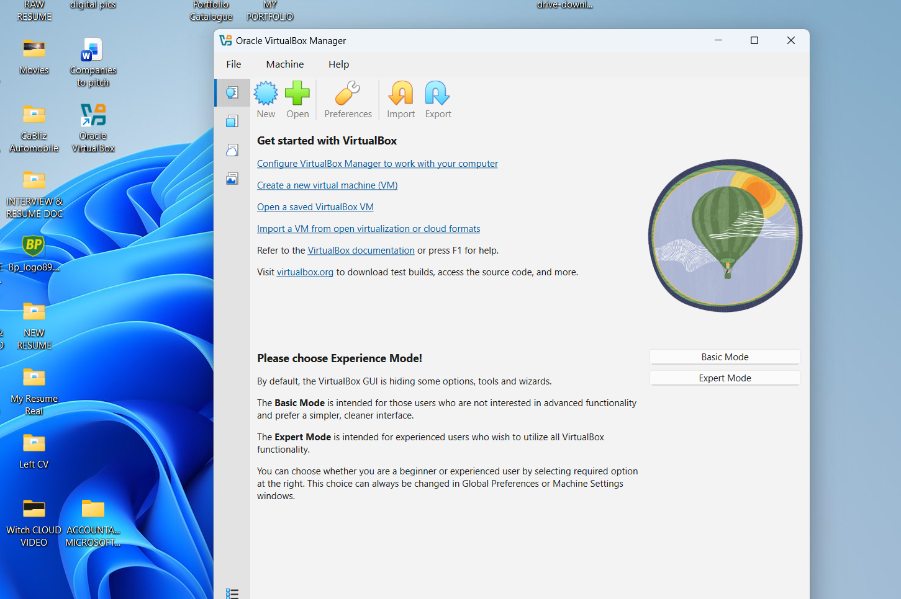
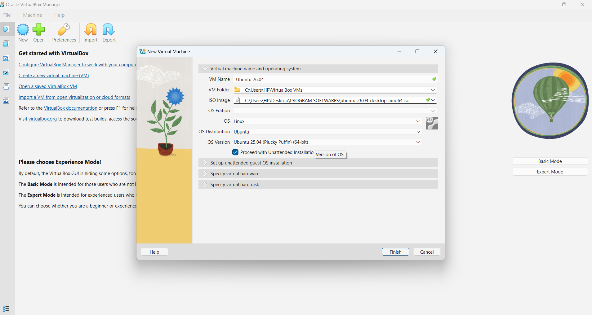
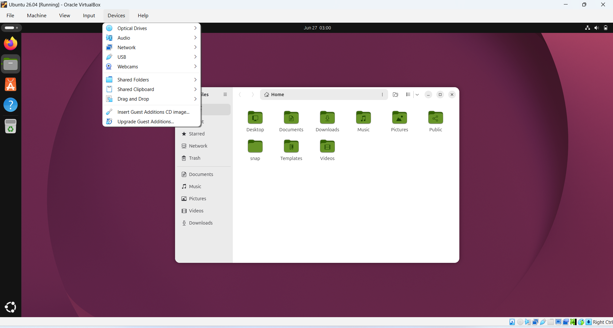

# Enterprise Linux Virtualization Lab

## Project Overview

This project documents the successful deployment of an Ubuntu Linux virtual machine using Oracle VirtualBox on a Windows host machine.

Rather than simply installing Ubuntu, this project demonstrates my understanding of virtualization, virtual machine provisioning, Linux deployment, resource allocation, and infrastructure troubleshooting.

This repository is the first project in my Cloud Engineering Portfolio, where I document my hands on infrastructure projects while learning Microsoft Azure and Amazon Web Services (AWS).

---

## Business Scenario

As a Junior Cloud Engineer, one of the first responsibilities is to prepare reliable environments for testing, administration, and future cloud deployments.

Before working with cloud platforms such as Microsoft Azure and AWS, engineers often build local virtual environments to practice Linux administration, networking, and infrastructure management.

This project simulates that process by creating a reusable Ubuntu virtual machine using Oracle VirtualBox.

---

## Project Objectives

The objectives of this project were to:

- Learn the fundamentals of virtualization.
- Install Oracle VirtualBox.
- Deploy an Ubuntu Linux virtual machine.
- Allocate compute resources (CPU, Memory, Storage).
- Configure a bootable Ubuntu ISO.
- Successfully install Ubuntu Desktop.
- Document the deployment process.
- Troubleshoot installation issues.
- Prepare a Linux environment for future cloud projects.

---

## Solution Architecture

The virtual environment created in this project consists of a Windows host operating system running Oracle VirtualBox as the virtualization platform. Oracle VirtualBox provides the resources required to host an Ubuntu Linux virtual machine, creating an isolated environment for learning Linux administration and cloud infrastructure concepts.

```text
+------------------------------------------------+
|            Physical Laptop (Host)              |
|------------------------------------------------|
| Windows 11 Operating System                    |
|                                                |
|  +------------------------------------------+  |
|  | Oracle VirtualBox (Type 2 Hypervisor)    |  |
|  |                                          |  |
|  |  +------------------------------------+  |  |
|  |  | Ubuntu Desktop Virtual Machine     |  |  |
|  |  |                                    |  |  |
|  |  | • 6 GB RAM                         |  |  |
|  |  | • 4 vCPUs                          |  |  |
|  |  | • 50 GB Virtual Disk               |  |  |
|  |  +------------------------------------+  |  |
|  +------------------------------------------+  |
+------------------------------------------------+
```
---

# Deployment Process

The following steps document the complete deployment of the Ubuntu Linux virtual machine using Oracle VirtualBox.

## Step 1 – Download Oracle VirtualBox

Downloaded and installed Oracle VirtualBox on the Windows host machine to provide a virtualization platform capable of running multiple operating systems.

**Screenshot**



---

## Step 2 – Download Ubuntu Desktop ISO

Downloaded the Ubuntu Desktop ISO image from the official Ubuntu website. The ISO file serves as the bootable installation media for the virtual machine.

**Screenshot**


---

## Step 3 – Create a New Virtual Machine

Created a new Ubuntu virtual machine within Oracle VirtualBox.

Configured the following resources:

- Operating System: Ubuntu (64-bit)
- Memory Allocation: 6 GB RAM
- Processor Allocation: 4 vCPUs
- Virtual Hard Disk: 50 GB

**Screenshot**



---

## Step 4 – Attach the Ubuntu ISO

Mounted the Ubuntu Desktop ISO as the bootable installation media before starting the virtual machine.

**Screenshot**



---

## Step 5 – Install Ubuntu Desktop

Booted the virtual machine from the Ubuntu ISO and completed the operating system installation by selecting language, keyboard layout, installation type, timezone, and creating a local administrator account.

**Screenshot**


---

## Step 6 – First Successful Login

Successfully booted into Ubuntu Desktop after installation and verified that the operating system was functioning correctly.

**Screenshot**


